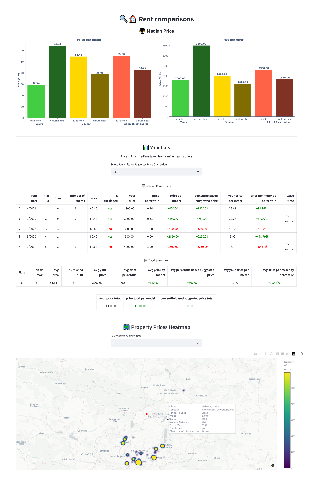
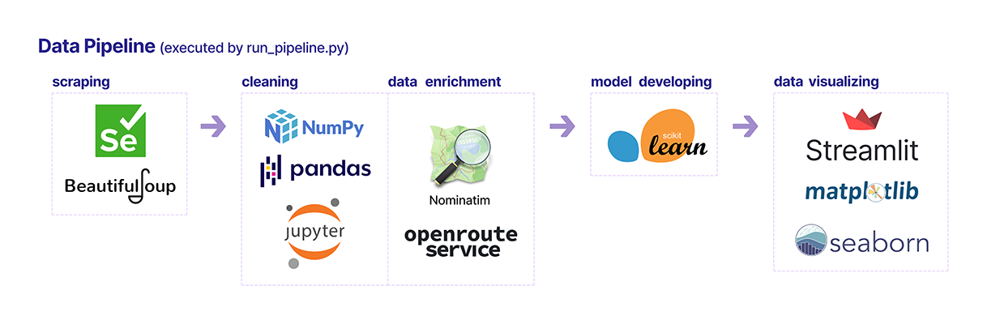

# 🔍🏠 Home Market Harvester Project

## 📋 Overview

The Home Market Harvester is a complete data system designed to `gather` -> `purify` -> `analyze` -> `train model` -> `display information` about the real estate market. It focuses on specific areas, comparing selected properties with the general market.

The system features an interactive dashboard that shows an overview of local market trends, compares selected properties with the market, and includes a map showing where the properties are located.

It gathers data from [`olx.pl`](https://www.olx.pl/) and [`otodom.pl`](https://www.otodom.pl/), which are websites listing properties in Poland.

The program runs on a personal computer and uses free, open-source tools along with two additional services for improving the data. These services provide location details through [`Nominatim`](https://nominatim.org/release-docs/latest/library/Getting-Started/) and calculate travel times via [`openrouteservice`](https://openrouteservice.org/). The dashboard is built with the [`streamlit`](https://docs.streamlit.io/) framework, allowing it to be accessed via a local web address and shared with others.

## 📊 Data Visualization



## 🗂️ Project Structure



### 📚 Most important libraries

**scraping:**

- [**`Selenium:`**](https://selenium-python.readthedocs.io/)
  _Interact with dynamically generated content and provide javascript interactions._
- [**`Beautiful Soup:`**](https://www.crummy.com/software/BeautifulSoup/bs4/doc/)
  _Extracting the data from the HTML page-source._

**cleaning:**

- [**`NumPy:`**](https://numpy.org/)
  _Support for large, multi-dimensional arrays and matrices._
- [**`pandas:`**](https://pandas.pydata.org/)
  _Tools for reading, writing, and manipulating tabular data._
- [**`jupyter:`**](https://jupyter.org/)
  _Facilitates incremental code development, enabling users to write and execute code in manageable chunks, thereby enabling step-by-step data visualization, review, and iterative adjustments._

**data enrichment:**

- [**`Nominatim:`**](https://nominatim.org/)
  _Transforms addresses into geographic coordinates using OpenStreetMap data, enhancing the mapping and visualization of property listings._
- [**`openrouteservice:`**](https://openrouteservice.org/)
  _This API calculates routes and travel times using OpenStreetMap data, improving the accuracy of travel planning displayed on maps._

**model developing:**

- [**`scikit-learn:`**](https://scikit-learn.org/stable/)
  _Library for machine learning that offers tools for data analysis and pattern detection. It includes efficient options like regression models, which are ideal for training quickly and accurately, even with small data sets._

**data visualizing:**

- [**`Streamlit:`**](https://docs.streamlit.io/)
  _A framework that simplifies creating web apps for data analysis and machine learning, enabling developers to turn data scripts into interactive, public web applications with minimal coding._
- [**`matplotlib:`**](https://matplotlib.org/)
  _Used for creating static, interactive, and animated visualizations in Python. Implemented for the bar charts and the map._
- [**`seaborn:`**](https://seaborn.pydata.org/)
  _Visualization library based on matplotlib that provides a high-level interface for drawing attractive and informative statistical graphics, making data visualization both easier and more aesthetically pleasing._

### 🗜️ Pipeline Elements Breakdown

- **`data`**: Houses both raw and processed datasets.
- **`logs`**: Archives logs from the pipeline operations, such as scraping and system activity.
- **`model`**: Stores machine learning models developed from the housing data.
- **`notebooks`**: Contains Jupyter Notebooks for data analysis, cleaning, and model creation in the app development.
- **`pipeline`**: The backbone of the project, encompassing scripts for scraping, cleaning, data model creation, and visualization.
- **`.env`**: A key file for setting important variables needed for the pipeline to work properly.

Each stage of the **`pipeline`** (**`a_scraping`**, **`b_cleaning`**, **`c_model_developing`**, **`d_data_visualizing`**) is executed sequentially:

- **Scraping (`a_scraping`):** Collects initial data from specific sources.
- **Cleaning (`b_cleaning`):** Enhances data quality by removing errors and making it ready for analysis.
- **Model Developing (`c_model_developing`):** Works on building and improving machine learning models.
- **Data Visualizing (`d_data_visualizing`):** Displays data and insights through interactive dashboards.

Subdirectories such as **`orchestration`** and **`config`** help these processes by offering tools, helper functions, and configuration management for smooth pipeline operation.

## 📦 Requirements

Look at [`Pipfile`](Pipfile)

## ⚙️ Installation

To set up the project environment:

```bash
pip install pipenv
pipenv install
pipenv shell
```

**🚨 Note**:
It's important to remember that the pipeline relies on external data sources, which may be subject to A/B tests, frontend changes, anti-bot activity, and server failures.

## 🔧 Configuration

Found in the [`pipeline/config`](pipeline/config) directory, this setup makes it easier to manage API keys, file paths, and server settings:


- Dynamic Naming with [`run_pipeline.conf`](pipeline/config/run_pipeline.conf): The `MARKET_OFFERS_TIMEPLACE` variable automatically names data storage directories using timestamps and locations, such as `2024_02_20_16_37_54_Mierzęcice__Będziński__Śląskie`. This helps keep data organized and easy to find.

- Security with `.env` File: Important details like `API` keys, `USER_OFFERS_PATH`, `CHROME_DRIVER_PATH`, and `CHROME_BROWSER_PATH` are stored here for better security.

- It's essential to get and set up the required API key for [`openrouteservice`](https://openrouteservice.org/) and include paths like [`CHROME_DRIVER_PATH`, `CHROME_BROWSER_PATH`](https://stackoverflow.com/a/77614979/12490791), and `USER_OFFERS_PATH` in the .`env` file.

## 🔨 Usage

The app can be executed by running the `run_pipeline.py` script found within the `pipeline` directory.

```bash
python pipeline/run_pipeline.py --location_query "Location Name" --area_radius <radius in kilometers> --scraped_offers_cap <maximum number of offers> --destination_coords <latitude, longitute> --user_data_path <path to your data.csv>
```

For example, to collect up to `100` housing offers within `25` km of `Warsaw` at coordinates `(52.203531, 21.047047)`, and compare them with your data stored at `D:\path\user_data.csv` _(this step is optional)_, use the following command:

```bash
python pipeline/run_pipeline.py --location_query "Warszawa" --area_radius 25 --scraped_offers_cap 100 --destination_coords "52.203531, 21.047047" --user_data_path "D:\path\user_data.csv"
```

## 💻 Development

The `notebooks` directory includes Jupyter Notebooks that provide an interactive environment for developing and handling data. These notebooks are meant for development only, not for production.

---

The pipeline supports running each stage independently as a Python script, except for the `d_data_visualizing` stage. This stage uses the [`streamlit`](https://docs.streamlit.io/) framework to produce interactive visualizations. For more details on this component, see the [streamlit_README](pipeline/stages/d_data_visualizing/README.MD).

## ✅ Testing

The `tests` directory contains scripts that check the functionality and reliability of different parts of the pipeline. Right now, only the scraping phase has automated tests.

To execute the tests use the following command:

```bash
pipenv shell # at the root of the project
python -m unittest discover -s tests -p 'test_*.py'
```

---

## 💡 Lessons Learned

During the development, three significant insights were gained:

1. **Preserving HTML Source Code for Data Integrity**
Due to the instability of `web scraping` sources, we save the `HTML` source code of each listing. This practice prevents data loss during processing and makes it easier to extract data if listings change. The small size of HTML files means they don’t take up much disk space or affect performance, making this method efficient and practical.

2. **Executing Python Scripts**
Running `Python` scripts directly from `.py` files is more effective than converting `Jupyter Notebooks` to `.py` files and then running them. The latter often causes issues with library compatibility. Direct execution avoids these problems and ensures smoother development.

3. **Codebase Structure Simplification**<br>
   The project initially adopted a modular approach, with each step executed as a separate subprocess. This complexity hindered effective testing due to changing the behavior of the subprocesses in the `unittest` environment. It is more effective to integrate the codebase and use function calls within a single process for easier testing and maintenance.

4. **Updating Environment Variables During Runtime**<br>
   To prevent issues with `environment variables` not updating correctly, it is better to directly modify `system files` within the project.

## 📜 License

This project is licensed under the terms of the [LICENSE](LICENSE) file located in the project root.

---

**Note**: This README covers the overall project. For detailed information on specific components or stages, please see the README files in the respective [stages directory](pipeline/stages).
